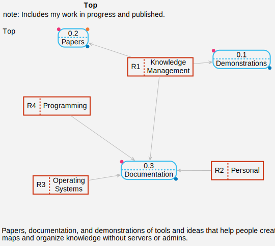
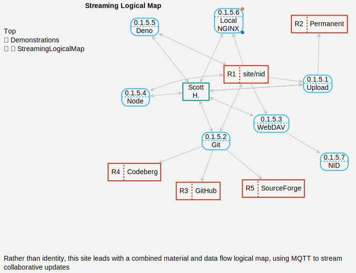

# Orientation 

{#fig:top s=.55 a=r}

It is easy to get lost within complicated and interrelated systems. There are many parties vying for our attention and resources.  When lost in new or unfamiliar situations, we orient ourselves with a map and compass. Simply reviewing the streams of information passing by does not give us enough information.  When lost at sea or in the forest, this is literal, and a 2D map can help. When navigating, fixing, changing, or imagining new systems, regular 2D maps are often not sufficient.  I've spent five years developing mapping tools that are flexible, yet easy to use.  The features include visual indicators, auto-routing, and integration with narration.  It is a complicated, interrelated system used to model the same, but I've done my best to make it useful without servers or admins.  

We tend to "chunk" as we read; we glob on to bits that catch our eye. While it is possible to digest a paragraph in a well-ordered way, having inline icons helps our natural instincts. It is knowledge reverse judo. \ada \trs \sya \tsa \lgi \lmp are the inline icons for this paper. They are the same in the PDF and web versions.  At the top of [systemsa.net](https://systemsa.net), there is a \lmp that  brings up a logical map like [@Fig:top].  I use this to switch the browser from narrative to map view. \lmp is fully described in \ada, the Logical Map How-to Guide. The inline icons have a URL, and depending on your application capabilities, click on the icon for the meaning or copy/paste into a web browser.  \tsa stands for Triple System Analysis, and means the general idea of using triples for system analysis.  I use a more sophisticated version of icons and navigation in \tsa: the section topics are icons.This document that you are reading is represented by \sya, both the narrative and the \lmp that combines logical and physical relations of data flow. At the top level are broad categories.  The second level can be accessed by clicking on the body of the node, and lists artifacts and efforts within that category.  The third level down shows the physical persistence information and flow.  A 🌐 is a URL associated with the entity.  Click on it to navigate to it in a web browser.   \trs means the idea of using combined data and material flow at time of crisis. I write about collaborative streaming of logical maps using nostr event objects over MQTT, and use \lgi to represent this paper. I will assume in \sya paper that the reader has reviewed the target URL behind the icons.

# Technical Design

There are design decisions for \ada \trs \tsa \lgi that are absent, not fully covered, or have changed slightly in my other documentation. I will discuss these in this section.  My overall goal is to provide the reader everything they need to continue this work without my ongoing guidance or updates.

## Floppy PNG

I experimented quite a bit with both performance and running live websites to come up with the final format of Floppy PNG. 

{#fig:flp s=.47 a=l}
 
 I introduce the idea in \trs. The Floppy PNG website is as the technical description and provides validation via past signatures [@h_floppy_2025] [@h_acodrstfpng-sign-serve_2025].  As I write this, most sites I run have different versions, and some have none at all. Over time I will migrate them.  [@Fig:flp] shows a typical \lmp at detail.  The Upload process uploads a Floppy PNG image to Permanent [@h_permanent_2025]. In this case, this is a demonstration of \lgi. When viewing in a web browser, click on the 🌐 symbol at the lower left edge of the node to browse to the referenced resource.  The entire demonstration is contained in the Floppy PNG file on Permanent.  Likewise, this document and the associated \lmp is uploaded to Permanent as a Floppy PNG.
 
The Local NGINX entries  in [@Fig:flp] point at the correct localhost HTTP TCP port. @Lst:nginxconf shows what I have put in my own local configuration in `/etc/nginx/sites-available`.

The performance of the Floppy PNG, from my experiments, comes from appending an object directly on the page via a variable, rather than loading through a fetch. I do this with a JS bootstrap next to the PNG with the same filename, except instead of .png, the extention is .js. The object can be retrieved by entering #export-site in the web browser URL.  This will download a file named export_site.txt into your Downloads folder configured in your browser.

```{#lst:nginxconf  .json .numberLines caption="Streaming Logical Map NGINX config"}
server {
  listen 4016;
  server_name localhost;
  root /home/divine/websites/site/nid;
  index noidentity.dev.page.html;
  location / {
    try_files $uri $uri/ =404;
  }
}
```

## Pandoc Toolchain

I use Pandoc to generate both HTML and PDF versions of the documents.

## Deno

I use Deno for creation and maintenance of the documentation and maps.

# Processes

Process are the light blue boxes with rounded corners and a dashed cross line like in [@Fig:flp].To access processes with 🌐, just click on 🌐.  If you zoom in to the body of the node, there are more details.  Most of web servers that are publicly available are on the Wayback Machine [@noauthor_internet_nodate].  It is also easy to bring up a local version of the sites using the Floppy PNGs, which are archived on Permanent [@h_permanent_2025].

# Data Stores
Data stores are the reddish-brown boxes with rounded corners and a dashed vertical line like in [@Fig:flp].  To download the latest store, click on 🌐.  Most of the data is in the Floppy PNGs, which are archived on Permanent [@h_permanent_2025]. Public repositories hold the rest.  The Floppy PNG for \sya will also store all important code and data.

# References

<div id="refs"></div>
\newpage

\

\newpage